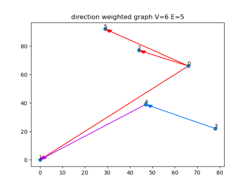

# OOP_Ex3 - Weighted Directed Graph 
## Intro 
In this project , we implented an interface of a weighted directed graph in `python` by using our Ex2 which we crated the same interface, but on `java`. 
The interface is contains the following classes :

Interface | Class                   
------------ | -------------                    
GraphInterface | DiGraph
GraphAlgoInterface | GraphAlgo

* Each vertex in the graph is represneted by the class `NodeD` 

* DiGraph is implements `GraphInterface` and by using some more methods.

* GraphAlgo is implements `GraphAlgoInterface`, this class is adjusting the graph structure for some 
  methods for comparison between the libary `NetworkX` and our previous java libary.
  This class have several methods that finds the shortest path, by using Dijkstra's algorithem, and     checking the SCC between connected components algorithem.
  
   
  
  
  

To see how we use each class , click  [Here](https://github.com/danielberco/OOP_Ex3/wiki) to see this project wiki page for more.

## Graph's libaries comarpisons :
We comapred our interface with NetorkX libry and our previous java libary.

______________________
## Resources :
[Dijkstra's algorithm](https://en.wikipedia.org/wiki/Dijkstra%27s_algorithm)

[Kosaraju's algorithm](https://en.wikipedia.org/wiki/Kosaraju%27s_algorithm)

[Elegant ways to support equivalence](https://stackoverflow.com/questions/390250/elegant-ways-to-support-equivalence-equality-in-python-classes)

**Click [Here](https://github.com/danielberco/OOP_Ex3.git) to download this project.**

    

